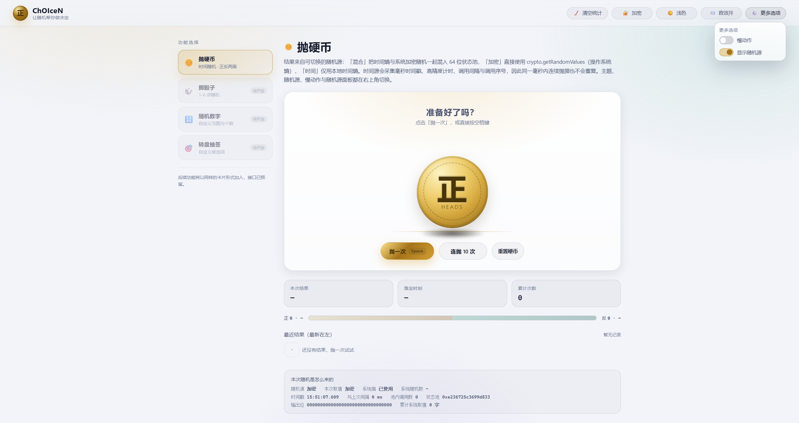

# ChOIceN · 让随机帮你做决定

一个纯 **HTML + CSS + JavaScript** 的随机决策小站（抛硬币 + 掷骰子）：无框架、无构建、无依赖。
结果先由**可切换的随机源**（时间熵 / 系统加密随机 / 两者混合）决定，动画只负责把它表演出来。

> 双击 `index.html` 就能用 —— 不需要服务器、不需要联网、不需要 `npm install`。

线上地址：<https://choice.imhaoyuan.tyu.me>（仓库里的 `CNAME` 即该域名，走 GitHub Pages）

| 浅色主题 | 深色主题 |
| --- | --- |
|  |  |

顶部栏「更多选项」下拉（慢动作 / 显示随机源两个开关）：



> `.preview/` 里的截图只用于快速预览，界面改动后不一定同步更新，以实际页面为准。

---

## 1. 已实现

| 能力 | 说明 |
| --- | --- |
| 抛硬币 | 2D 透视翻转动画、抛起与落地阴影、落定高光（为什么刻意不用 3D 见第 4 节） |
| 掷骰子 | 1–6 颗一起掷，面数可选 4 / 6 / 8 / 10 / 12 / 20；逐颗落定、d6 画点阵、其它面数画数字（见第 5 节） |
| 骰子统计与分布 | 本次点数、本次总和、累计次数与累计骰子数；按面数分桶的概率分布柱状图，d6 与 d20 的数据不会混 |
| 随机源可选 | 混合（时间熵 + 系统加密随机，默认）/ 加密（`crypto.getRandomValues`）/ 时间（纯时间熵） |
| 时间熵 | 毫秒时间戳 + 高精度计时 + 调用间隔 + 调用序号 → 64 位状态池 |
| 同毫秒不重复 | 同一毫秒内连续抛掷也能得到不同结果 |
| 统计与历史 | 累计次数、正反次数与占比、最近结果条（最新在左，最多保留 60 条）；顶部栏一键清空 |
| 随机源可视化 | 面板实时展示当前源、本次取值走的路径、系统随机数、时间戳与间隔、状态池、输出位等；抛硬币页与掷骰子页共用同一个面板 |
| 连抛加速 | 「连抛 10 次」自动切换到更快的动画档（单次抛掷保持原速，见 4.1） |
| 深色 / 浅色主题 | 默认按本地时间自动切换（**08:00–17:59 浅色**），也可手动固定 |
| 音效 | WebAudio 实时合成（抛起 / 空中 / 落定三段），不依赖音频文件，可开关 |
| 偏好持久化 | 统计 / 历史 / 设置 / 主题模式 / 随机源 / 骰子偏好写入 localStorage |
| 快捷键 | `空格` 抛一次 / 掷一次；`Alt+1..4` 切换功能（未开放的功能会提示「还在规划中」） |
| 响应式与无障碍 | 五档断点 + `prefers-reduced-motion`，详见 1.1 |

**所有开关都在右上角标题栏，页面主体不放设置项**（点按循环的按钮 + 一个下拉列表）：

| 按钮 | 交互 |
| --- | --- |
| 🧹 清空统计 | 点按清空**全部**统计与历史（抛硬币 + 掷骰子，带二次确认） |
| 🔀 随机源 | 点按循环 混合 → 加密 → 时间 → 混合 |
| ⏱️ 主题 | 点按循环 跟随时间 → 浅色 → 深色 → 跟随时间 |
| 🔊 音效 | 点按开关音效 |
| ⚙️ 更多选项 | 展开下拉列表：慢动作 / 显示随机源 |

五个按钮宽度统一（`min-width` 锁死），所以切换文案时整排不会左右抖动；窗口变窄时自动只留图标（每个按钮都有 `title` 提示）。

### 1.1 响应式与无障碍

五档断点都在 `css/styles.css` 末尾：

| 断点 | 行为 |
| --- | --- |
| ≤ 900px | 侧边栏折到顶部，功能卡片横向滚动 |
| ≤ 860px | 顶部栏只留图标（`min-width` 一起让开，避免图标间出现大片空白） |
| ≤ 760px | 顶部栏允许换行兜底 |
| ≤ 560px | 硬币缩小（`--size: 150px`）、骰子收到 `--die-size: 56px`、按钮内边距收紧、下拉面板留出边距 |
| ≤ 400px | 骰子再收到 `--die-size: 46px`（6 颗会自然折成两行，这是刻意的，不硬塞一行） |

- 系统开启「减少动态效果」时，`@media (prefers-reduced-motion: reduce)` 会把所有动画与过渡压到接近瞬时。
- 语义与可达性：结果区 `aria-live="polite"` 播报、功能卡片用 `aria-current` 标记当前位置、纯图标按钮都带 `title`、装饰性图标 `aria-hidden`、下拉用 `aria-haspopup` / `aria-expanded` / `aria-controls`。
- HTML 里已经埋了 `data-i18n` 属性，但**目前没有多语言实现**，那是给将来预留的钩子。

## 2. 目录结构

```
ChOIceN/
├── index.html              页面骨架 + 顶部栏（清空统计/随机源/主题/音效/更多选项）+ 首屏防闪主题脚本
├── css/
│   └── styles.css          设计令牌（深浅两套）、组件样式、硬币与骰子动画、响应式与无障碍
├── js/
│   ├── rng.js              随机源（时间熵 / 系统加密随机 / 两者混合，可切换、可循环）
│   ├── store.js            localStorage 封装（统计 / 历史 / 设置 / 骰子统计与历史，统一 choicen.v1. 前缀）
│   ├── audio.js            WebAudio 实时合成音效（抛硬币 / 骰子 / 点数和）
│   ├── theme.js            主题：按时间判定 + 手动切换 + 持久化
│   ├── ui.js               DOM 构造、格式化、提示条、开关控件等小工具
│   ├── coin.js             硬币元件（翻转动画 + 币面切换 + 运动模糊）
│   ├── entropy.js          「本次随机是怎么来的」随机源面板（抛硬币页与掷骰子页共用）
│   ├── dice.js             骰子元件（点数面渲染 + 逐颗落定动画 + 速度档位）
│   ├── modes.js            功能注册表 + 抛硬币视图 + 掷骰子视图 + 未来功能占位
│   └── app.js              启动、hash 路由、侧边导航、顶部栏全部控件、偏好广播
├── smoke-test.mjs          无浏览器冒烟测试（见第 7 节）
├── check-inline-theme.mjs  校验首屏防闪脚本与 theme.js 规则一致（见第 7 节）
├── .preview/               界面截图（浅色 / 深色 / 顶部栏下拉）
├── CNAME                   GitHub Pages 自定义域名
├── LICENSE                 MIT
└── README.md
```

脚本按依赖顺序用普通 `<script>` 加载（无模块打包），顺序在 `index.html` 末尾固定：
`rng → store → audio → theme → ui → coin → entropy → dice → modes → app`，`smoke-test.mjs` 也用同一份清单。

## 3. 随机是怎么来的

### 3.1 三种可切换的随机源

切换入口是**右上角标题栏的「随机源」按钮**：点一下换一个，
顺序是 混合 → 加密 → 时间 → 混合（和旁边的主题按钮同一套交互），
按钮上的图标与文字会跟着变。当前源同时也显示在页面的「随机源」面板里。

| 源 | 内部名 | 图标 | 说明 |
| --- | --- | --- | --- |
| **混合**（默认） | `hybrid` | 🔀 | 时间熵 + 系统加密随机一起混入 64 位状态池 |
| **加密** | `crypto` | 🔐 | 直接用 `crypto.getRandomValues`（操作系统熵），取出即结果，不再混时间 |
| **时间** | `time` | 🕒 | 仅本地时间熵，完全不碰 `crypto`（老行为） |

```js
App.rng.cycle();                    // 循环切换（顶部栏按钮用的就是它），返回新源名
App.rng.setSource('crypto');        // 直接指定（会通知订阅者，顶部栏按钮自动更新）
App.rng.getSource();                // 'hybrid' | 'crypto' | 'time'
App.rng.info();                     // 诊断信息，界面的「随机源」面板就靠它
```

选择会存进 `choicen.v1.settings.rngSource`。

> `cycle()` 只在**当前环境可用的源**之间循环。没有 `crypto.getRandomValues` 时
> 可用源只有 `time`，这时点按钮会原地不动，而不是切到一个并不存在的「加密」上；
> `setSource('crypto')` 在这种环境下也会自动降级为 `time`（`smoke-test.mjs` 有断言）。

### 3.2 关于「真随机」——需要说清楚的部分

网页里**拿不到硬件真随机数发生器（TRNG）**，浏览器没有这个接口。
`crypto.getRandomValues` 是操作系统熵池（Windows 的 `BCryptGenRandom`、Linux 的 `getrandom`）
播种的密码学安全伪随机数发生器（CSPRNG）——它不可预测、不能由时间推算，
浏览器给密钥和 nonce 用的就是它。**这是网页能拿到的最接近「真随机」的来源**，
所以在界面上它叫「系统加密随机」而不是「真随机」，免得给人错误的期待。
如果场景要求可公证的强随机（例如抽奖开奖），应当使用外部硬件或第三方服务。

### 3.3 时间熵怎么采集（`time` 源）

1. 采集时间熵：`Date.now()`、`performance.now()` 的整数与小数部分、与上次调用的间隔、调用序号；
2. 用 FNV-1a 变体把这些位混进 64 位状态池，跑一轮 xorshift64\*，再做一次雪崩；
3. 归一化到 `[0, 1)`，或取最低位决定正/反面。

`混合` 源在第 2 步之前额外把两个 32 位系统随机数混进池子；
`加密` 源则跳过整个时间熵流程，直接返回系统随机数。

其他实现细节：

- `int(max)` 用**拒绝采样**消除取模偏差，不是 `floor(float()*max)`；
- `float()` 由两次 32 位取值拼出 53 位精度；
- 没有 `crypto` 的环境（老浏览器、Node 桩测试）会自动降级为 `time`，不报错。

> 注意：`side()` 会**自己消耗一次随机数**。不要改成读取上一次留下的位，
> 否则会读到陈旧值，导致结果恒定（开发过程中真的踩过这个坑）。

另一个坑：末尾雪崩不能写成 `bits ^= bits >>> 31`——那会把最低位恒置为 0，
而正反面恰好读最低位，结果就会永远是正面。

## 4. 硬币为什么不用 3D 变换

经典写法是 `rotateX` + `preserve-3d` + `backface-visibility: hidden`。
实测这条路依赖渲染器实现细节，**会渲染出「镜像的正面字」**：

- DOM 上只要有 `filter`（哪怕只是 `filter: blur(0)`），3D 上下文就被扁平化，`backface-visibility` 失效；
- 部分渲染器（软件渲染 / 关闭 GPU 合成）直接忽略 `backface-visibility`；
- 3D 上下文里子元素的绘制顺序由深度排序决定，不保证按 DOM 顺序。

所以改为**纯 2D 透视模拟**，结果是确定性的：

- 用 `scaleY(|cos θ|)` 模拟转轴压扁，最小 0.04 给出「侧面对着你」的瞬间；
- 厚度由 `.coin__layer--top` 的 `box-shadow` 在下方露出一线实体边缘色（`--coin-edge`），
  并随 JS 写入的 `--coin-k` 一起收放。**曾经用「叠一个下层、露出另一面的颜色」来模拟厚度，
  结果是金色币面下方露出一线青色，像镶边**，所以改成了现在这种；
- 由 JS 按角度显式切换币面（`0°–90° / 270°–360°` 正面，`90°–270°` 反面），隐藏用 `display: none`，绝无重叠；
- 运动模糊放在独立图层，按角速度调模糊量与透明度——`filter` 只加在这一层上；
- 币面内容很少：大字「正 / 反」，下面一行 `Heads / Tails`，即 `faceMarkup()` 一处模板同时供清晰层与模糊层使用。

### 4.1 连抛 10 次的动画会加速

两档参数都在 `js/modes.js` 的 `FLIP_NORMAL` / `FLIP_FAST` 里：

| 场景 | 时长 | 圈数 | 间隔 |
| --- | --- | --- | --- |
| 单次「抛一次」 | 2500ms | 5–8 | — |
| 「连抛 10 次」 | 850ms | 3–4 | 110ms |

10 次从原来的 **27 秒以上** 降到约 **10 秒**。圈数必须跟着时长一起降：
时长缩短后若还转 8 圈，角速度过高会糊成一片，反而看不清翻转。
「慢动作」开关照旧对两者都乘 1.8 倍（尊重用户选择）。

## 5. 掷骰子

入口是侧边栏的 🎲 卡片（`#/dice`，`Alt+2`）。

### 5.1 规则与控件

| 参数 | 取值 | 说明 |
| --- | --- | --- |
| 骰子颗数 | 1–6 | 默认 2 |
| 每颗面数 | 4 / 6 / 8 / 10 / 12 / 20 | 默认 d6 |

颗数与面数是**本功能自己的参数**，不属于全局设置，所以放在页面里（用 `.picker` 单选组），
但存进 `choicen.v1.dicePrefs`，下次打开还是你选的那套。
注意这里没有复用 `.seg`——那个类已经随底部设置面板一起删掉了，
`smoke-test.mjs` 专门断言页面里不该再有 `.seg`，所以另起了 `.picker`。

> **`.picker` 的选中高光由选择器自己维护**（`picker()` 里的 `setValue`），
> 不劳驾调用方在 `onChange` 里记得调一次。第一版就是把这件事甩给了调用方，
> 结果点击只改了参数、`aria-pressed` 一直停在初始值上，
> 于是「点了按钮没有切换过去的高光」（用户报的正是这个）。
> 现在 `onChange` 返回 `false` 表示「这次点击不生效」（例如正在掷骰），此时高光也不动。
> `smoke-test.mjs` 补了「点完之后 `aria-pressed` 必须跟着走」的断言——
> 原来的断言只验了初始值，所以没能拦住它。

两个按钮：**掷一次**（`空格`）、**重置骰子**。
「重置骰子」只清掉当前显示的骰面与结果，**不动累计统计**；
要清空统计与历史是顶部栏那个「清空统计」（它清的是抛硬币 + 掷骰子全部数据）。

> 骰子这边**没有**「连掷 10 次」。抛硬币保留它是因为抛一次要 2.5 秒，连抛能省下大量时间；
> 而掷一次骰子本来就只有 0.7 秒左右（6 颗逐颗落定约 1.4 秒），
> 再来个「连掷 10 次」既没有省时间的价值，又会让分布图被一次点击灌进 10 组数据。
> 组件层随之只保留一档动画参数（`ROLL_NORMAL`），加速档位是连掷按钮一起删掉的。

### 5.2 d6 画点阵，其它面数写数字

`faces === 6` 时按九宫格画点（1–6 点各自的点位见 `js/dice.js` 的 `PIP_LAYOUT`），
其它面数一律用 `.die__num` 直接写数字。

这不是偷懒：d20 要画 20 个点在 74px 的面上只会糊成一团，而且真实的 d20 本来也不画点。
d6 则相反——不画点的骰子不像骰子。

**没有结果时不画任何面**（空格子 + `--empty` 样式），不摆一个假的 1 点充数。

### 5.3 结果先定，动画只负责表演（这条是铁律）

和抛硬币同一条原则，但在骰子上更容易踩坑，因为它有「翻滚换面」这个环节：

```js
// js/modes.js
function drawValues() {                       // 先把结果全取出来
  const faces = dice.getFaces();
  const out = [];
  for (let i = 0, n = dice.getCount(); i < n; i++) out.push(App.rng.int(faces) + 1);
  return out;
}
async function doRoll() {
  const values = drawValues();                // ← 结果在这里就定死了
  await dice.roll(values, {...});             // ← 动画只是把它演出来
  commit(values);                             // ← 记录的正是上面那组值
}
```

所以**翻滚过程中切换的假面绝对不能消耗 `App.rng`**：一旦动画也从随机源取值，
记录的结果与骰子最终显示的面就会分叉（尤其是慢动作时看得一清二楚）。
`js/dice.js` 里那些闪烁的假面用的是元件内部一个私有 LCG：

```js
flicker = (Math.imul(flicker, 1664525) + 1013904223) >>> 0;
```

它看起来足够乱，但它和 `App.rng` 毫无关系。
`smoke-test.mjs` 用「掷 n 颗则随机源调用次数必须落在 `[n, n+2]`」把这条钉死了——
动画只要多取一个数，断言立刻失败。

另一个同类坑：`--spin`（翻滚圈数）必须写成 **360° 的整数倍**。
翻滚动画是 `animation-fill-mode: forwards` 停住的，如果终态不是 360° 的整数倍，
落定时移除动画类，骰子会「啪」地弹回原点一下。

### 5.4 两档动画参数

都在 `js/dice.js` 的 `ROLL_NORMAL` 里：

| 单颗时长 | 逐颗间隔 | 换面间隔 |
| --- | --- | --- |
| 720ms | 130ms | 70ms |

逐颗落定：第 i 颗晚 `stagger × i` 起跑，先到的先定住，
每颗落定都会回调 `onLand(i, value)` 播一声硬碰硬的骰子声，全部落定后 `await` 才返回。
6 颗的整轮时间因此是 `720 + 130 × 5 ≈ 1.4 秒`。
「慢动作」开关会乘 1.8 倍；系统开了「减少动态效果」时，
JS 侧直接把时长压到 60ms、间隔压到 0（动画靠 CSS 那条 `prefers-reduced-motion` 兜底）。

### 5.5 分布按面数分桶，d6 和 d20 永远不混

统计长这样（`choicen.v1.diceStats`）：

```js
{ rolls: 12, dice: 26, sum: 91, lastSum: 6, faces: 6,
  dist: { "6": { "3": 2, "5": 4, ... }, "20": { "18": 1, ... } } }
```

**为什么要分桶**：d6 掷出「3」和 d20 掷出「3」完全是两回事，
混在一张图上会得出错误的直觉（d20 每面只有 5%，混进去会把 d6 的分布压平）。
所以分布图**只画当前面数那一桶**，切到 d20 时 d6 的数据还在，只是不画。
`store.js` 的 `getDiceStats()` 会对这份结构做一次清洗，`dist` 是数组之类的脏数据会被丢掉。

历史条每格记的是**一次掷骰的总和**（悬停能看到 `d20 · 18 + 7 = 25 · 时间`），
和硬币页的「最新在左」一致，上限同为 60 条。

### 5.6 改颗数 / 面数会清掉当前显示的结果

因为屏幕上那几个点数是按旧参数渲染的，留着就是误导。
换面数还会把骰面全部清空，并且顺手重画分布图（口径变了）。
掷骰过程中这几个控件是 `disabled` 的——半途换参数会让动画和结果对不上。

## 6. 深浅主题

三种模式，点顶部栏的主题按钮循环切换：**跟随时间 → 浅色 → 深色 → 跟随时间**。
（原来页面最下方还有一个主题切换，已经删除，现在只剩顶部栏这一个入口。）

| 模式 | 行为 |
| --- | --- |
| 跟随时间（默认） | 本地时间 **08:00–17:59 用浅色**，其余用深色；运行期间跨过 8 点 / 18 点会自动切换（每 60 秒检查一次） |
| 浅色 | 始终浅色 |
| 深色 | 始终深色 |

实现要点：

1. **首屏防闪**：`index.html` 的 `<head>` 里有一段内联脚本，在样式表之前就把
   `data-theme` 写到 `<html>` 上（顺带改 `colorScheme` 与地址栏配色的 `theme-color`）。
   否则会先渲染深色、脚本跑起来再跳成浅色。
   这段脚本不能引用外部文件，所以它的规则与 `js/theme.js` 的 `themeByTime()` 必须同步——
   用 `check-inline-theme.mjs` 自动校验（见第 7 节）。
2. **两套令牌**：颜色全部走 CSS 变量，深色定义在 `:root, [data-theme="dark"]`，
   浅色整体覆盖在 `[data-theme="light"]`。组件样式里**不允许写死颜色**，
   否则浅色模式一定会漏改。新增颜色时请同时在两个块里加令牌。
3. **主题按钮**：`app.js` 里的 `createThemeButton()` 是唯一的实现，顶部栏用的就是它；
   `ctx.themeControl()` 可以让任何功能视图拿到同款按钮（目前抛硬币页不再需要，但接口留着）。
   样式与状态（`data-mode` / `data-changed` 动画）由 `app.js` 统一维护。
4. **通知条件要看「模式」而不是只看「外观」**（这里踩过坑，改动 `theme.js` 的 `apply()` 前请先读）：
   `auto → light → dark → auto` 的第三次点按，切回 auto 时时间解析出的外观与上一次固定模式**相同**，
   如果只在「解析结果变化」时才通知，按钮就不会被刷新，于是顶部栏停在「深色」，
   而弹窗（即时计算）显示「跟随时间」，两者对不上。
   所以 `apply()` 的模式名变化与外观变化都要触发通知；`smoke-test.mjs` 里
   「切回 auto 且外观未变时，按钮文字仍会更新为『跟随时间』」就是这条的回归断言。
5. 模式存在 `choicen.v1.settings.theme`，与其它偏好一致。

## 7. 自动化测试

`smoke-test.mjs` 用最小 DOM 桩在 Node 里加载全部前端脚本，共 **196 项运行时断言**，
按 9 个部分输出（`[1] 启动与挂载` … `[9] 掷骰子`），失败会以非 0 退出码结束：

- 挂载、占位功能渲染、路由；
- **随机源**：三种源各自都验证「落在 [0,1) / 均值接近 0.5 / 正反面均衡 / 同毫秒不重复」，
  并分别确认 `crypto` 源真的消耗系统随机数且不混时间熵、`time` 源完全不碰 `crypto`、
  `hybrid` 源两者都用；切换回调、顶部栏按钮的文案与图标同步、
  **点按循环 三步走满一圈回到默认值**、偏好写入，
  以及**在没有 `crypto` 的环境里自动降级为 `time`（连 `cycle()` 都原地不动）且不报错**
  （用一个独立的 vm 上下文跑）；
- **抛硬币**：按角度切换币面、落定角度与结果一致、落定后显示的就是结果那一面、
  **单次抛掷仍是原速（约 2.5s）**、**连抛 10 次已加速（< 20s，原速需 27s 以上）**；
- **主题**：时间判定边界（7:59 / 8:00 / 17:59 / 18:00）、三种模式、循环切换、
  「切回 auto 时外观未变也要刷新按钮」的回归、持久化与重新 init、变化回调；
- **顶部栏「更多选项」下拉**：初始收起、点开、再点收起、点面板外收起、按 Esc 收起，
  面板里就是「慢动作 / 显示随机源」两个开关；
- **开关联动**：拨动慢动作要让硬币速度系数真的变成 1.8、关掉回到 1 并写入偏好；
  拨动「显示随机源」要能让页面里的随机源面板隐藏 / 恢复；
  以及**视图销毁时必须退订广播**（挂一个探针功能验证，漏退订会让已销毁的硬币视图继续收到通知）；
- 统计 / 历史写入、顶部栏「清空统计」按钮生效（**硬币与骰子一起清**）、存储重置；
- **掷骰子**：路由与标题、硬币页与骰子页**共用同一个随机源面板**且「显示随机源」开关对两页都生效、
  默认 2 颗 d6 且**初始不画面**、两个选择器的选项与 `aria-pressed`、
  **点击之后高光必须跟着走**（就是漏掉这条让「点了没高光」的 bug 溜到了线上）、
  改颗数/切面数**互不影响**、动作区只有两个按钮且没有「连掷」、
  掷一次之后统计 / 历史 / 总和 / 分布分桶都对上、
  **随机源调用次数必须落在 `[n, n+2]`（证明动画一个数都没多取）**、
  切 d20（点数用数字面渲染、分布分成 20 列、且与 d6 分开分桶）、
  重置、慢动作系数、销毁退订、以及新挂载的硬币视图能收到设置广播；
- **页面里不该再有** `.settings` / `.seg` / `.setting-item`（底部设置面板已移除）。

`check-inline-theme.mjs` 单独校验 `index.html` 的首屏脚本：
它真实执行那段内联代码，用 11 组「时间 × 已保存偏好 × URL 覆盖」组合比对结果，
并确认它与 `js/theme.js` 的时间区间完全一致。

```powershell
node smoke-test.mjs            # 196 项断言，需要 Node 16+（用了 node: 前缀导入与类私有字段）
node check-inline-theme.mjs    # 首屏防闪脚本一致性
```

> 桩里的选择器引擎**只支持单个简单选择器**（`.class` / `#id` / `tag`，逗号分隔的多选也行），
> **不支持 `.a .b` 这类后代组合子**——写了不会报错，只会静默匹配到 0 个元素，
> 断言于是变成一个永远失败（或永远通过）的空检查。要在容器下面找节点，
> 先 `querySelector` 拿到容器，再对它 `querySelectorAll`。

> 写涉及「当前时间」的断言时要小心：**不要假设跑测试时 auto 会解析成哪一种外观**。
> 曾经把「先固定成深色、再切回 auto」当成「外观不变」的场景，白天跑时 auto 解析成浅色，
> 前提不成立，测试就随机失败。正确做法是先算出 `themeByTime(new Date())` 再据此构造场景
> （见 `smoke-test.mjs` 主题那一段的注释）。

`stats` / `history` / `settings` / `diceStats` / `diceHistory` / `dicePrefs` 的键名统一带 `choicen.v1.` 前缀，
未来升级可平滑迁移。

## 8. 怎么加下一个功能

1. 在 `js/modes.js` 的 `App.modes.list` 里加一条：

```js
{
  id: 'wheel', icon: '🎡', name: '转盘抽签', desc: '把选项转到指针上',
  available: true,                       // 改 true 后侧边卡片即可点击
  mount: function (root, ctx) {          // 在 root 里渲染自己的界面
    // ctx.go('coin') 切换功能；ctx.toast('...') 弹提示；ctx.isActive() 判断当前是否可见
    // ctx.themeControl() 拿一个主题切换按钮；ctx.resetStats() 清空统计
    // ctx.onSetting(fn) 订阅顶部栏开关的变化，返回退订函数 —— mount 返回的 destroy 里必须调用它！
    // App.rng.int(6) + 1 取随机数（自动跟随用户选的随机源）；App.store.record(...) 记统计
    // App.store.read / write 是通用读写接口（同样带 choicen.v1. 前缀），掷骰子的偏好就存在这里
    // App.ui.switchControl('标签', 初值, onChange) 造一个和顶部栏同款的开关
    // App.createEntropyPanel({ visible }) 直接拿到那个随机源面板（抛硬币页与掷骰子页共用的就是它）
    return function destroy() { /* 退订 + 清理定时器 */ };
  }
}
```

2. 侧边导航、hash 路由（`#/wheel`）、卡片高亮、`Alt+数字` 快捷键都会自动生效；
3. 只需为自己的界面补样式，通用组件（`.panel` / `.btn` / `.metric` / `.switch` / `.chip` / `.menu` / `.picker`）
   可直接复用；颜色请引用 CSS 变量，这样两种主题都不用额外适配。

> **结果要先定、动画只负责表演**（第 5.3 节）：新功能如果用 `App.rng` 决定结果，
> 一定先把结果全部取出来再去播动画。动画中途取随机数会让「显示的结果」和「记录的结果」分叉，
> 而且这种 bug 在快动画下几乎看不出来。
>
> `App.createEntropyPanel()` 已经把订阅 `App.rng.onChange`、渲染那 10 个字段、随「显示随机源」开关
> 显隐的活全干了，视图只需要把它挂进 DOM、在结果产生后调一次 `render()`、销毁时 `destroy()`。

> **视图里不要再放全局设置项。** 主题、随机源、慢动作、显示随机源都已经收在顶部栏，
> 新功能如果有自己的开关，优先考虑放进「更多选项」那个下拉列表（在 `app.js` 的 `initMoreMenu()` 里加），
> 或者像掷骰子的「颗数 / 面数」那样，只做局部的、明显属于本功能的控件。

> **退订很重要**：`ctx.onSetting()` 是广播制的，一个开关会通知所有订阅者。
> `mount` 返回的 `destroy` 里如果不退订，切一次功能就多堆积一个订阅者，
> 已经销毁的视图还会继续收到通知去操作不存在的 DOM。
> `smoke-test.mjs` 第 [8] 节专门用一个探针功能验证了这条（第一版断言写错了，是变异测试抓出来的），
> 第 [9] 节也用骰子视图再验了一遍。

已预留的占位功能：随机数字（`number`）、转盘抽签（`wheel`），
每张占位卡片都写了简介与 roadmap，见 `js/modes.js` 末尾。

## 9. 调试小开关

- `index.html#/coin` —— 默认视图（主题按时间自动决定）；`#/dice` 直接进掷骰子；
- `index.html?theme=light#/coin` —— 强制浅色；`?theme=dark` 强制深色；`?theme=auto` 回到按时间。
  这个覆盖只作用于当前这次打开，不会改写你保存的偏好；
- `index.html?demo=1#/coin` —— 打开后自动抛一次，方便看结果态（可与 `?theme=` 叠加）；
  `?demo=1#/dice` 同理，进去自动掷一次；
- `window.__coin` —— 控制台可直接访问硬币对象（`renderAngle(120)`、`visibleFace()`、`currentAngle()`）；
- `window.__dice` —— 控制台可直接操作骰子元件：
  `__dice.show([1,6])` 摆出指定点数（不播动画）、`__dice.roll([2,5])` 演一遍落定、
  `__dice.setFaces(20)` / `setCount(4)` / `getValues()` / `isRolling()` / `valueAt(0)`；
- `App.theme` —— 控制台可直接调用 `App.theme.setMode('light')` / `App.theme.themeByTime(new Date())`；
- `App.rng` —— 控制台可直接切换随机源并查看诊断：

```js
App.rng.cycle();               // 循环切换，返回新源名（顶部栏按钮用的就是它）
App.rng.setSource('crypto');   // 'hybrid' | 'crypto' | 'time'
App.rng.getSource();
App.rng.info();                // { source, crypto, cryptoWords, pool, bits, ... }
```

### 9.1 关于无头 Chrome 验证

这台机器的 Chrome **`--dump-dom` 不出任何内容**（新旧 headless 都一样），
但 `console.log` 会进 stderr，所以「在真实浏览器里量布局 / 验接线」的正确姿势是：

```powershell
chrome --headless=new --disable-gpu --user-data-dir=<临时目录> `
  --window-size=1440,1200 --virtual-time-budget=4000 `
  --enable-logging=stderr --screenshot=<随便给个路径> <url> 2>stderr.log
# 然后从 stderr.log 里过滤 console 输出
```

两个很容易白跑一轮的坑：

1. **`--headless=new` 截的是整个窗口，不是视口。** `--window-size=1440,1400` 配
   `--force-device-scale-factor=1` 时截出来的 PNG 是 1440×1400，而页面里
   `window.innerWidth × innerHeight` 只有 1418×1302，横向还差约 11px 的窗口边框偏移。
   所以**不能拿 `getBoundingClientRect()` 的返回值去裁截图**，会整体错位；
   要从图里自己认出目标（或先用坐标匹配求出偏移），别默认两者相等。
2. **`--virtual-time-budget` 会饿死 `requestAnimationFrame`，也会冻住 CSS 过渡。** 虚拟时间下
   `setTimeout` 飞快地推进，但合成器给的帧极少（实测约 3 帧/虚拟秒），
   所以任何靠 rAF 计时的动画（硬币翻转就是）在虚拟时间里几乎跑不完，
   断言会看到「统计一直没 +1」。**CSS `transition` 同理**：带过渡的 `color` / `border-color`
   会一直停在过渡起点，读 `getComputedStyle` 看上去像「样式没生效」，其实只是没演完
   （`.picker__btn` 的选中高光就这样骗过我一次 —— 而同一规则里不在过渡列表中的
   `background-image` / `box-shadow` 是立刻生效的，于是表现得像「一条规则一半生效一半不生效」）。
   要验这两类交互，就得**去掉 `--virtual-time-budget`**——
   但那样 `--screenshot` 会让 Chrome 截完立刻退出，脚本活不到断言：
   改成不加 `--screenshot` 直接起进程、`Start-Sleep` 等真实秒数、再 `Stop-Process`，从日志里看结果。
3. **想拿 CSS 坐标去裁截图，先自己解出偏移。** 一个稳妥的办法：让页面在已知 CSS 坐标处
   打两个纯色小标记（`position: fixed`，不受滚动影响），截图后从图里找出这两个标记，
   反解出偏移再裁。这样就不必假设「截图像素 == 视口像素」，也不必依赖窗口边框有多宽。

另外它的窗口宽度**压不到约 497px 以下**（`clientWidth` 会停在 497），
要测 375px 这类真实手机宽度，得用一个固定宽度的 `iframe` 来制造窄视口
（需要加 `--allow-file-access-from-files` 才能读 iframe 的 `contentDocument`）。

## 10. 部署与环境要求

- **纯静态**：把仓库根目录原样丢到任意静态托管即可（GitHub Pages / Netlify / Vercel / 对象存储），
  **没有任何构建步骤**，也不需要在服务器上跑 Node。
- **本仓库用的是 GitHub Pages + 自定义域名**：推送后在仓库 `Settings → Pages` 选择分支根目录发布，
  域名由根目录的 `CNAME`（`choice.imhaoyuan.tyu.me`）指定。因为全是相对路径，放在子路径下也能正常打开。
- **浏览器要求**：现代浏览器（用到 ES6 对象方法简写、`Object.assign`、`String.padStart`）。
  没有 `crypto.getRandomValues` 的老环境会自动降级为纯时间源，不报错。
- **`file://` 下**：直接双击 `index.html` 也能用；个别浏览器 / 隐私模式下 localStorage 可能被禁用或隔离，
  `store.js` 对读写异常做了静默退化，此时只是不记住统计与偏好，功能本身照常。

## 11. 许可

MIT License，© 2026 ImHaoYuan —— 详见 [LICENSE](LICENSE)。
